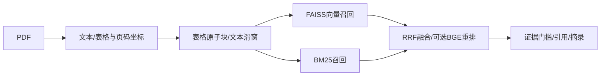

## 第一阶段修复（2026-10-09）

历史全库 100 题仍是 2 题正确、27 题错误回答、71 题拒答，逐题证据分诊见 `results/audit-20261009/`。新代码把给定报告与问题显式指定公司年份的全库协议分开，按范围检索，数值评分对齐 FinQA 百分数执行口径；这些 CPU 修复尚未经过新的 Qwen 模型质量验收。冻结的 200 题公开留出 ID 和协议限制见 [评测协议草案](docs/PROTOCOL_20261009.md)，页面转录代理实验不能当成完整年报业务验收。

## 全链路补充（2026-10-08）

新增官方数据逐条来源审计及不提供正确文档的全库检索→受控计算评测。保留 0% 数值回答覆盖率的失败结果，不沿用给定正确文档的成绩，见 [端到端审计](docs/E2E_AUDIT.md)。

## 原帖路线更新（2026-10-05）

本仓库是当前原帖路线版本；实验协议、结果和限制见 [docs/EXPERIMENTS.md](docs/EXPERIMENTS.md)。RAG 检索在 CPU 上完成真实 BGE/CrossEncoder 对照，不把项目一的 Qwen3-8B 训练结果混入本项目指标。

# 金融研报 RAG：表格保护、检索对比与引用

实现文本 PDF 解析、表格保护切块、FAISS/BM25/RRF 混合召回、引用溯源、证据不足拒答、索引保存与演示页面。

**当前同时保留 27 组 TF-IDF 消融，以及 FinQA 100 问子集上的 BGE dense、BM25、BGE hybrid、RRF+MiniLM 重排实测。**
默认回答直接摘录证据；真实大模型生成通过项目三接入。合成数据中的公司和财务数字全部虚构。

## 快速运行

Python 3.12，在仓库目录中：

```sh
python -m venv .venv
# Windows PowerShell: .venv/Scripts/Activate.ps1
# Linux/macOS: source .venv/bin/activate
python -m pip install -r requirements.txt
python -m pytest -q
python -m finrag.cli --query "星河科技2025年营业收入是多少？"
python scripts/evaluate.py
python -m uvicorn finrag.api:app --host 127.0.0.1 --port 8001
```

打开 http://127.0.0.1:8001 查看 demo，/docs 查看 API。服务启动时先完成索引加载，/health 的 ready 字段反映就绪状态。

## PDF 与检索流水线



```sh
python scripts/ingest.py data/synthetic-report.pdf --output artifacts/parsed.json
python -m finrag.cli --data artifacts/parsed.json --save artifacts/pdf-index --query "Revenue 2025"
```

PDF 解析会把检测到的表格区域从普通正文移除，避免重复；保留文档 ID、页码、表格 bbox。表格即使超过 chunk size 也整体保留，因此后续模型上下文长度仍需控制。当前多栏解析只使用中缝启发式，不是完整布局识别；扫描件没有 OCR 时明确报错。中文字体、复杂跨页表格、页眉页脚和图表仍需要用真实 PDF 扩展验证。

默认切块单位为**字符**，不是 token。配置三组 size/overlap：256/50、512/100、1024/200。检索支持 Flat、IVF、HNSW；小型语料的 IVF 聚类警告是预期现象，当前 nlist=1，不能据此推断大规模索引性能。

BM25 使用中文字符/二元组与英文数字 token；RRF 使用名次融合，避免直接相加不可比的 BM25 与 cosine 分数。纯 BM25 路径不执行向量编码。

## BGE 路径与实测结果

```sh
python -m pip install -e ".[bge]"
python -m finrag.cli --config configs/bge.json --query "星河科技营业收入"
```

中文配置使用 BAAI/bge-large-zh-v1.5 和 BAAI/bge-reranker-v2-m3；已保存的 FinQA 英文实验使用英文 BGE small 与 MiniLM CrossEncoder，二者不可混称。服务使用 RAG_CONFIG 指向配置文件，或用 EMBEDDING/RERANKER 环境变量覆盖。相同 512 字符/Flat 设置下，BGE dense、BM25、BGE hybrid、RRF+MiniLM 重排 Recall@5 分别为 75.83%、63.83%、72.17%、75.33%；详见实验报告。

## 引用、拒答与评测口径

返回答案、refused、hits 与 citations；每条引用包含 doc_id、page、chunk_id、quote 和 bbox。默认摘录返回原始证据，避免凭空生成财务数字。
拒答门槛使用中文二元组/英文数字的词面覆盖，排除仅匹配单个汉字的弱证据；显式年份必须存在于候选证据。覆盖率不是校准过的概率，也不能解决所有同名公司、跨年指标和多跳推理问题。

```sh
python scripts/evaluate.py
```

评测有 21 条合成 QA，其中 19 条可回答、2 条不可回答。对比 3 组切块 × 3 种索引 × 3 种召回，共 27 组。分别报告：

- document_recall_at_k：各问题所需文档的平均覆盖率。
- evidence_recall_at_k：候选块包含标注答案片段的平均覆盖率，多文档问题按所需证据条数归一化。
- refusal_fixture_pass_rate：是否与合成标签一致；不是金融问答准确率。
- mean_query_ms：检索阶段耗时，不包括回答生成；首次导入和构建有冷启动开销。

数据规模很小，真实结果不能外推到几百份研报。现有结果并不支持“混合检索必然最好”。报告保留失败问题和真实对比，没有预填提升数字。

## 索引与项目内容

finrag.cli 保存 vectors.faiss、metadata.json 和 TF-IDF encoder.joblib；程序可通过 Retriever.load_trusted 恢复。仅加载自己生成的索引；joblib 和 FAISS 文件不是安全的任意外部上传格式。
源码位于 src/finrag/；测试覆盖表格完整性、PDF 提取、召回、引用、拒答、索引变体和保存恢复。结果位于 results/，说明见 [docs/EXPERIMENTS.md](docs/EXPERIMENTS.md) 与 [docs/BADCASES.md](docs/BADCASES.md)。

上传方式见 [docs/GITHUB.md](docs/GITHUB.md)，技术依据见 [docs/SOURCES.md](docs/SOURCES.md)。

## 2026-10-08 全链路验收与失败结果

在已审计的官方 FinQA 100 题子集上，全局 BM25 检索 → Qwen3-8B 表格计划 → 证据数值校验 → Decimal 单运算执行的覆盖率为 29%，原始执行答案准确率仅 2%，证据 Recall@5 为 63.83%。预测器没有接收金标 doc_id、答案或程序，原始预测、提示与拒绝原因保存在 `results/finqa-model-20261008*`。这份公开测试此前已检查过，并非全新盲测；结果揭示错公司证据与运算选择问题，不能宣称金融问答已达到可用准确率。

对 Hologic 2008 年报原始 PDF 的独立审计发现固定字符间距阈值会吞掉英文空格，现改用字宽比例，并加入真实 PDF 格式的回归测试。`scripts/audit_pdf.py` 可下载后解析并导出哈希、物理页码与检索轨迹；`results/pdf-audit-20261008.json` 记录来源和实际结果。合同义务查询在 BM25 排名第一、混合检索排名第三命中物理第 84 页（印刷页 76）；该页无边框表格仍以正文保留，不能把检测到的 12 个表格解释为完整表格识别能力，也不能将单份 PDF 验证扩展为全部 FinQA 原 PDF 验证。

协议限制：不少 FinQA 原问题依赖指定报告上下文，问题本身未写公司/年份。这里直接使用原问题做全库检索，会引入歧义，2% 不能与给定报告的论文准确率直接比较，也不能全部归因于计算能力。应另建明确公司/年份的用户查询协议，作为独立实验，不能事后改写本次预测。
